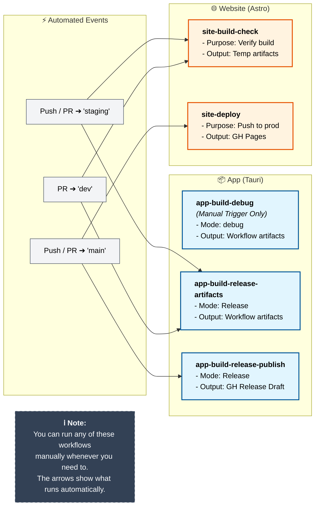

## `app-build-debug`

- when we need debug builds while bugfixing

## `app-build-release-publish`

- when we want to publish a new version of the app

## `app-build-release-artifacts`

- when we just want the build bundles of the app without publishing it

## `site-build-check`

- when we just to build the site for final local testing
- we download the `site-build-output.zip` from the workflow artifacts and extract with:

  ```sh
  unzip site-build-output.zip
  cd site-build-output
  mkdir Cherit
  mv * Cherit
  ```

  then, actually run the server

  ```sh
  bunx serve .
  ```

  then navigate to `http://localhost:3000/Cherit` in browser to run the built site.
