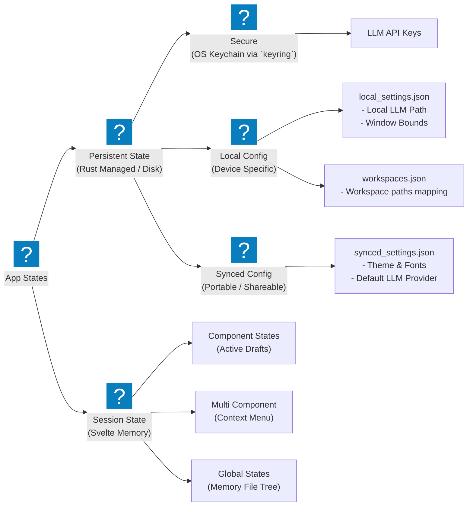

import { Card, CardGrid } from '@astrojs/starlight/components';

so generally, an app's states fall into 2 main categories

<CardGrid>
  <Card title="Sessions States" icon="seti:clock">
    the non persistent states only required for current session and don't need to be persisted
  </Card>
  <Card title="Persistent States" icon="substack">
    the states that need to be persisted amoung sessions
  </Card>
</CardGrid>

In case of Cherit, we can divide states into further categories 

as of right now, from all the branches, these are the states that are present in the project

- [x] markdown content state: the actual markdown content that the user is going to Create/Update/Delete. Stored as simple madown file on the file system with directories
- [ ] Current Workpsace Root Path
- [ ] Most Recent Opened Workspace root path
- [ ] All Recent Workpsace root path
- [ ] ip of devices paired with current device
- [ ] workspace mapping for each device
- [ ] LM provider name
- [ ] LM's name
- [ ] LM provider API key

- Various Dialog Open/CLose States
- Currently Opened file state
- Collapse states of folder in file manager
- 

# Session States
# Persistent States 
these states have thier own `.json` files in the AppData Directory
## Secure States
although these states come under Persistent States, they are not stored in a `.json` file, instead it will be stored in the OS-native Keychain using either the [Stronghold](https://v2.tauri.app/plugin/stronghold/) or [Keyring](https://crates.io/crates/keyring) Plugin (not decided on which to use yet)

