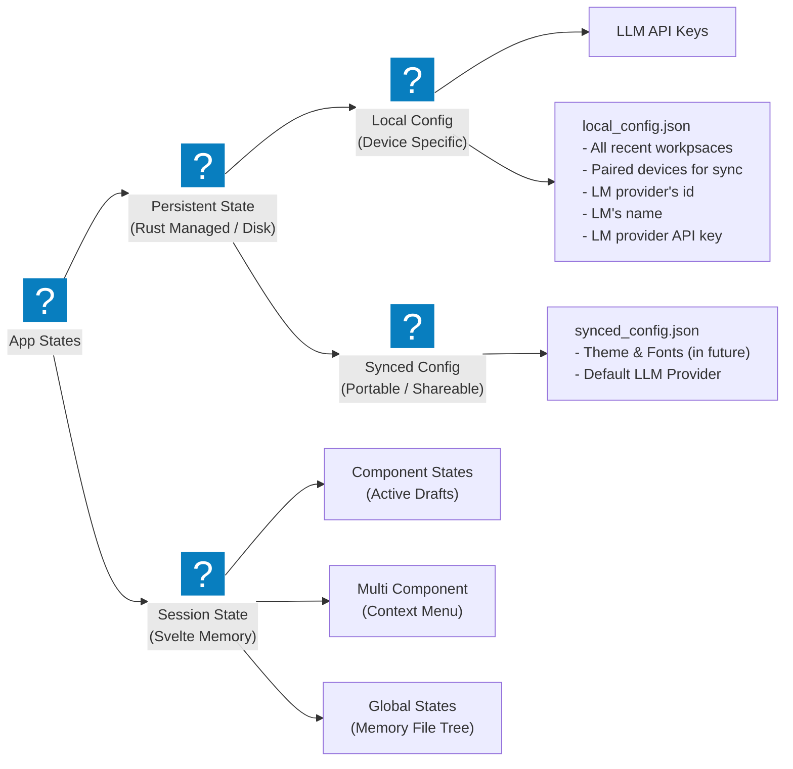

import { Card, CardGrid } from '@astrojs/starlight/components';

so generally, an app's states fall into 2 main categories

<CardGrid>
  <Card title="Sessions States" icon="seti:clock">
    the non persistent states only required for current session and don't need to be persisted
  </Card>
  <Card title="Persistent States" icon="substack">
    the states that need to be persisted amoung sessions
  </Card>
</CardGrid>

In case of Cherit, we can divide states into further categories 

## What is being stored?

2 files in the app data dir. and 1 in a secure way

### 1. `local_config.json`

a schema tracked plain json file managed by rust backend of the tauri app for storing locally.

### 2. `synced_config.json`

also an schema tracked plain json file managed by the rust backend for syncing across devices.

### 3. Secure storage

some sensitive data like api keys and things like that mustn't be accessible by the outside OS\
to ensure that, the Secure Storage works on all platofrmsm, it a good decision to go with the official Tauri Plugin [Stronghold](https://v2.tauri.app/plugin/stronghold/) or [Keyring](https://crates.io/crates/keyring).

## Communication Stratergy

$$
\text{Svelte} \longleftrightarrow \text{Rust}
$$

The frontend only cares about the sessions and persistent states. it doesn't care about which states are synced or stored securely.\
Menaing, the rust backend will abstract away the syncing and secure storage system to the frontend\
and the `src/lib/states` dir will have no mention of *Synced States* or *Secure States*

Simmilarly the Rust Backend doesn't care about the Frontend Session States

the only way Frontend -> Backend communicate is 2 simple tauri commands:
- one to get a json representing persistent states. or getting a partial state by telling the backend, which states to get
- one to set persistent states. this has to give the compelete persistent state to the backend

anytime, the frontend wanted to ask for persistent states, the tauri backend will respond with the full data not with a part of it
