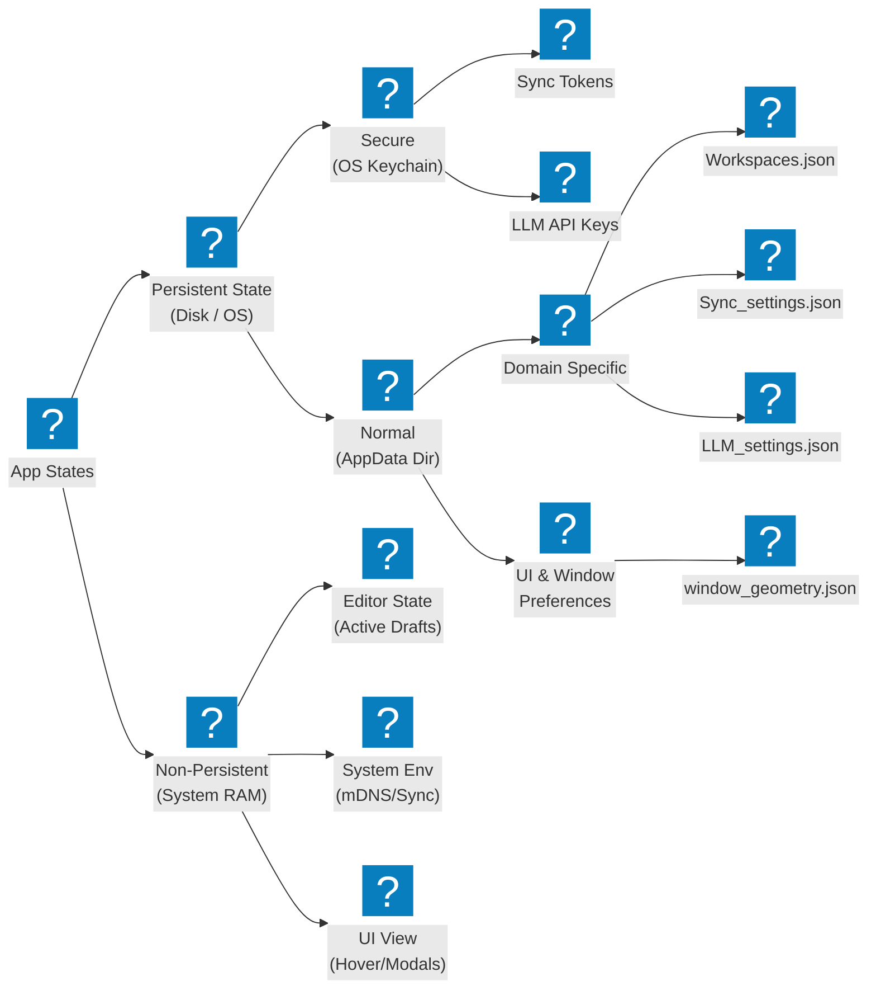

import { Card, CardGrid } from '@astrojs/starlight/components';

so generally, an app's states fall into 2 main categories

<CardGrid>
  <Card title="Sessions States" icon="seti:clock">
    the non persistent states only required for current session and don't need to be persisted
  </Card>
  <Card title="Persistent States" icon="substack">
    the states that need to be persisted amoung sessions
  </Card>
</CardGrid>

In case of Cherit, we can divide states into further categories 

